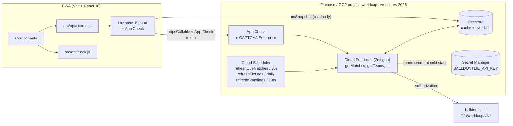
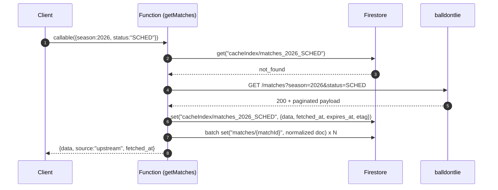
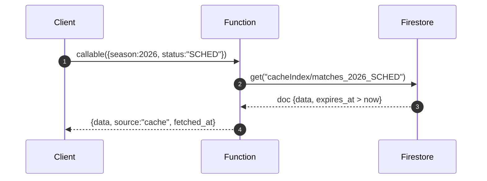
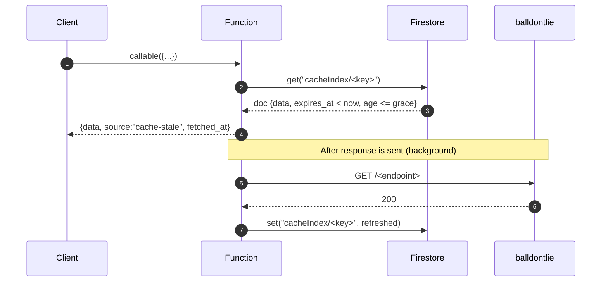
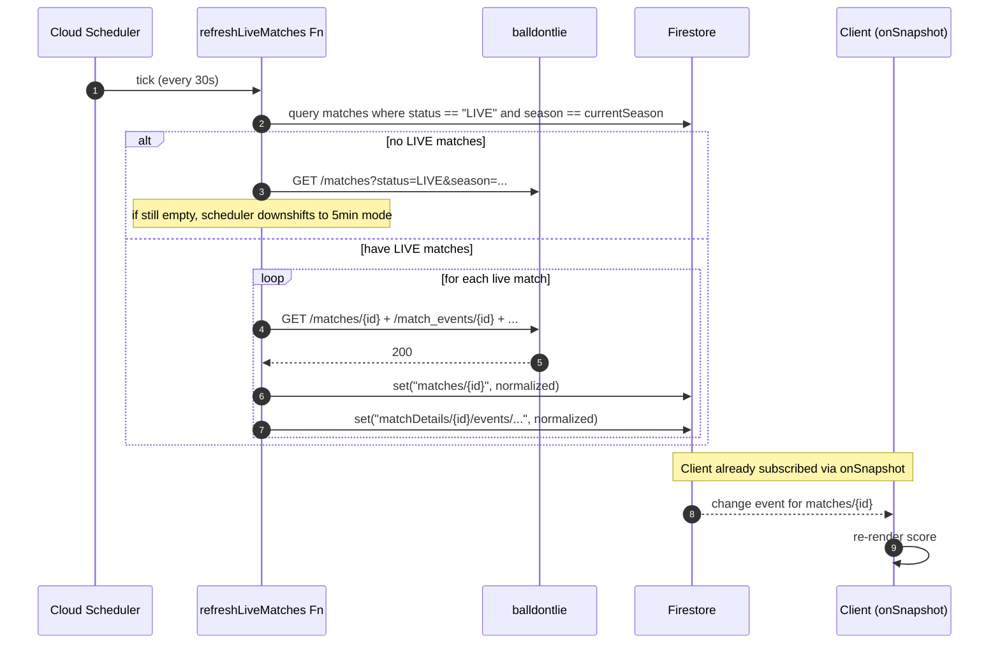

# 01 — Architecture

Status: draft, locked decisions in §0
Owners: platform
Companion docs: `00-overview.md` (scope), `02-data-contracts.md` (field shapes), `03-backend-functions.md` (handler code), `05-secrets-ops.md` (Secret Manager + App Check)

---

## 0. Locked decisions (do not relitigate here)

The following were decided in `00-overview.md` and are inputs to this spec:

- Backend pattern is **cache-aside proxy via Firestore**. Functions are the only thing that talks to balldontlie. The API key never leaves the server.
- Live matches refresh via **Cloud Scheduler → `refreshLiveMatches` Function every 30 s**. Clients subscribe to Firestore documents directly via `onSnapshot`; they do not poll the Function for live data.
- Default season is **2026**. `?season=2022|2018` query param overrides for historical browsing and demos.
- Production tier assumption is **GOAT**. Any 401/402/403 from upstream is surfaced to the client as `{ data: [], tier_required: true }` rather than an error.
- API key lives in **Firebase Secret Manager** as `BALLDONTLIE_API_KEY`. It is bound to Functions at deploy time via the `--set-secrets` mechanism. It is never bundled, never logged, never echoed in error messages.
- `.firebaserc` project = `worldcup-live-scores-2026`.

---

## 1. Goals & non-goals

### Goals

1. Replace `src/api/mock-data.js`-backed reads with live data from balldontlie, without changing the `src/api/scores.js` function signatures the UI already calls.
2. Keep p95 of any read under 1.5 s on cache miss and under 500 ms on cache hit, measured at the client.
3. Push live score updates to the UI within ~30 s of upstream change, without the client polling.
4. Keep the API key off the client at all times, including in error stacks and bundle source maps.
5. Stay under balldontlie's rate limit even during peak (parallel kickoffs of multiple group-stage matches).
6. Support historical season replay (2022, 2018) with the same code paths.

### Non-goals

- Real-time sub-10s updates. We are not building a streaming feed; 30 s is the target.
- Server-side rendering. The app stays a PWA; Functions serve JSON, not HTML.
- A general-purpose sports backend. This is scoped to balldontlie's FIFA World Cup endpoints.
- Authenticated user features (favourites, predictions, comments). Out of scope for this migration; the Firestore rules in §10 leave room for `users/*` later.
- A Redis / Memorystore tier. Firestore is the only cache; cost and complexity of a second tier is not justified at expected QPS.

---

## 2. High-level diagram

### Mermaid



### ASCII (for reviewers without mermaid)

```
+------------------------- PWA (browser) ----------------------------+
|                                                                    |
|  React components                                                  |
|       |                                                            |
|       v                                                            |
|  src/api/scores.js  <----- the seam; signatures unchanged          |
|       |             \                                              |
|       |              \--- onSnapshot ---> Firestore (read)         |
|       v                                                            |
|  Firebase JS SDK (httpsCallable + App Check token)                 |
+-----------|--------------------------------------------------------+
            |
            v
+----- App Check (reCAPTCHA Enterprise) -----+
            |
            v
+---------------- Cloud Functions (2nd gen) ---------------+
|   getMatches  getTeams  getGroups  getVenues  ...        |
|   getMatchDetails  getStandings  getLineup               |
|                                                          |
|   1. validate args (season, ids)                         |
|   2. look up cache doc in Firestore                      |
|   3. if fresh -> return                                  |
|   4. if stale/miss -> fetch upstream, write-through      |
|                                                          |
+----|----------------------------|------------------------+
     |                            |
     | reads/writes               | HTTPS w/ Authorization
     v                            v
+----------+              +----------------------+
| Firestore|              | balldontlie.io       |
|  cache   |              | /fifa/worldcup/v1/*  |
+----------+              +----------------------+
     ^
     | every 30s (or 5 min if no LIVE)
     |
+--------------------+
|  Cloud Scheduler   |
|  refreshLiveMatches|
|  refreshFixtures   |
|  refreshStandings  |
+--------------------+

Secret Manager (BALLDONTLIE_API_KEY) is bound to all Function
deployments via --set-secrets; it is never read from the client
and never logged in handler output.
```

---

## 3. Request paths

All three paths assume the client called a `httpsCallable` (e.g. `getMatches`) with App Check enabled. Validation, season scoping, and the App Check check happen before any of the steps shown.

### 3a. Cold read (cache miss)



### 3b. Warm read (cache hit, fresh)



Target latency: p50 < 200 ms, p95 < 500 ms.

### 3c. Stale read (cache hit, stale → revalidate)

We use **stale-while-revalidate**: if `now > expires_at` but `now < expires_at + soft_grace`, return the stale doc immediately and trigger an async refresh. If `now > expires_at + soft_grace`, refresh synchronously.



`soft_grace` defaults to `2 * TTL` per resource (see §6). Beyond that we hard-miss and block on the upstream call.

---

## 4. Live update path



The client never calls a Function during a live match. It calls `getMatches({status:"LIVE"})` once to bootstrap the list of ids, then attaches `onSnapshot` to each `matches/{matchId}` doc. The scheduler is the only writer.

```
Scheduler -> Fn -> Firestore -> all subscribed clients
                       ^
                       |
                  single source of truth
```

---

## 5. Firestore data model

Top-level collections. Every cached document carries the metadata fields listed at the bottom of this section. Field-level shapes (types, enums, nullability) live in `02-data-contracts.md`; this section is structural.

```
firestore/
  cacheIndex/
    {key}                       // see §6 for key shape; small docs, used as the "is it cached?" lookup
                                // payload here is the *list* response (e.g. matches list for a query);
                                // per-entity docs below are written through in the same transaction.

  teams/
    {season}_{teamId}           // e.g. "2026_FRA"
      code, name, group, season, fetched_at, expires_at, source_season, ...

  groups/
    {season}_{groupCode}        // e.g. "2026_A"
      code, name, teamIds[], season, ...

  venues/
    {season}_{venueId}          // stadiums endpoint
      name, city, country, capacity, season, ...

  matches/
    {matchId}                   // global id from upstream; we still tag season inside the doc
      season, status, kickoff, home{}, away{}, score{}, group, stage, venueId, ...
      // hot doc during LIVE; this is the one clients onSnapshot

  matchDetails/
    {matchId}/
      summary                   // single doc: avg_positions, momentum, best_players (denormalized)
      lineups/{teamCode}        // starting XI + bench
      events/{eventId}          // goals, cards, subs
      shots/{shotId}
      playerStats/{playerId}
      teamStats/{teamCode}
      momentum                  // single doc; overwritten on each refresh

  standings/
    {season}_{groupCode}        // {teams:[{teamId, P,W,D,L,GF,GA,Pts}], ...}

  players/
    {playerId}                  // sparse; only fetched on demand for player profile views

  rosters/
    {season}_{teamCode}         // list of playerIds + jersey numbers

  formations/
    {name}                      // static reference data (e.g. "4-3-3"); seeded, not from upstream

  meta/
    cache_index                 // counters, last full refresh timestamps, scheduler heartbeats
    rate_budget                 // token bucket; see §8
    health                      // last upstream status, last 5xx timestamp, etc.

  // reserved for future, not used today:
  users/
    {uid}/...
```

### Metadata fields on every cached document

| Field            | Type      | Notes                                                                            |
| ---------------- | --------- | -------------------------------------------------------------------------------- |
| `fetched_at`     | Timestamp | Server time the doc was last written from upstream.                              |
| `expires_at`     | Timestamp | `fetched_at + ttl`. Read path compares to `now`.                                 |
| `etag`           | string?   | If upstream returns an ETag, we keep it for future conditional requests.         |
| `tier_required`  | bool      | True iff upstream returned 401/402/403 for this resource on the last fetch.      |
| `source_season`  | number    | The season the doc was fetched under. Lets us reject cross-season reads safely. |
| `schema_version` | number    | Bumped when we change the normalized shape; consumers compare on read.           |
| `upstream_url`   | string    | The exact URL we hit, sans key. Useful for debugging; not exposed to clients.    |

### Why this layout

- **Per-match docs are the unit of live update.** Putting score/status in `matches/{matchId}` and pointing `onSnapshot` at it means we get push updates without designing a custom pubsub.
- **`matchDetails/{matchId}/...` is a subcollection** so we can cheaply load the heavy stuff (lineups, events, shots) lazily when the user opens a match detail screen, while the matches list query stays small.
- **`cacheIndex/{key}`** is the "did we already fetch this exact query shape?" lookup. It carries the full list payload so a callable can return without doing a second Firestore round trip. The per-entity write-through keeps individual docs queryable and snapshot-able.
- **Season is a prefix on every key that has cross-season meaning.** `matches/{matchId}` does not need the prefix because match ids are globally unique upstream, but it still carries `season` inside.

---

## 6. Cache key & TTL strategy

Cache keys are deterministic strings derived from the request shape, so two clients asking the same thing hit the same doc. All keys are lowercase, underscore-separated, and prefixed with the season.

| Resource                                | Cache key shape                                                  | TTL (default)            | Soft grace | Notes                                                                  |
| --------------------------------------- | ---------------------------------------------------------------- | ------------------------ | ---------- | ---------------------------------------------------------------------- |
| Teams (list)                            | `teams_{season}`                                                 | 24 h                     | 24 h       | Roster of 32 teams almost never changes during a tournament.           |
| Single team                             | `team_{season}_{teamCode}`                                       | 24 h                     | 24 h       |                                                                        |
| Venues / stadiums                       | `venues_{season}`                                                | 24 h                     | 24 h       | Static.                                                                |
| Groups                                  | `groups_{season}`                                                | 24 h                     | 12 h       | Re-pull after group draw.                                              |
| Group standings (pre-tournament)        | `standings_{season}_{groupCode}` with mode=`pre`                 | 1 h                      | 1 h        |                                                                        |
| Group standings (during matchday)       | `standings_{season}_{groupCode}` with mode=`live`                | 30 s                     | 60 s       | Scheduler updates this; client mostly reads from Firestore listener.   |
| Group standings (post-tournament)       | `standings_{season}_{groupCode}` with mode=`post`                | 24 h                     | 24 h       | Final table doesn't change.                                            |
| Matches list (no filter)                | `matches_{season}`                                               | 5 min                    | 10 min     |                                                                        |
| Matches list (status filter)            | `matches_{season}_{status}`                                      | 5 min normally / 30 s LIVE | 60 s     | When `status=LIVE`, scheduler keeps it warm.                           |
| Matches list (group / date filter)      | `matches_{season}_g_{groupCode}` / `matches_{season}_d_{yyyymmdd}` | 5 min                    | 10 min     |                                                                        |
| Single match — SCHED                    | `match_{matchId}`                                                | 5 min                    | 10 min     |                                                                        |
| Single match — LIVE                     | `match_{matchId}`                                                | 15 s                     | 30 s       | Primary path is the scheduler; client mostly listens.                  |
| Single match — FT                       | `match_{matchId}`                                                | 24 h                     | 7 d        | Finished matches are immutable; long grace is fine.                    |
| Match details (lineups, events, stats)  | `matchDetails_{matchId}_{section}`                               | 15 s LIVE / 24 h FT      | 30 s / 7 d | `section` ∈ `lineups`, `events`, `shots`, `playerStats`, `teamStats`, `momentum`, `bestPlayers`, `avgPositions`, `teamForm`. |
| Players (profile)                       | `player_{playerId}`                                              | 1 h                      | 6 h        | On-demand.                                                             |
| Rosters                                 | `roster_{season}_{teamCode}`                                     | 1 h                      | 6 h        | Updated when squads are announced.                                     |
| Odds / futures                          | `odds_{season}_{matchId}` / `futures_{season}_{market}`          | 5 min                    | 10 min     | TBD whether we surface these in v1.                                    |

### Rules

1. **TTL is computed at write time** and stored in `expires_at` so a TTL change requires no migration; old docs simply roll off as they expire.
2. **Status transitions force a re-evaluation.** When the scheduler observes a match move SCHED → LIVE → FT, it writes the new doc with the new TTL appropriate to the new status. There is no "downgrade" — a FT match never goes back to LIVE.
3. **Soft grace covers upstream outages.** If balldontlie is down and we're beyond `expires_at` but inside `expires_at + grace`, we serve the stale doc and tag the response `source: "cache-stale"`. Beyond grace, we attempt upstream; if it fails too, we still return the stale doc but tag `source: "cache-stale-degraded"` so the UI can show a banner.
4. **The client never sets TTL.** All TTLs are server-side constants in `functions/src/cache/ttl.ts`.

---

## 7. Scheduler design

Three scheduled jobs, all defined in `functions/src/scheduled/`.

| Job                  | Schedule (default)                | Schedule (live window)     | Purpose                                                                |
| -------------------- | --------------------------------- | -------------------------- | ---------------------------------------------------------------------- |
| `refreshLiveMatches` | every 5 min                       | every 30 s                 | Pull anything in `LIVE` status and write through.                      |
| `refreshFixtures`    | daily 04:00 UTC                   | unchanged                  | Pull the full season fixture list once per day.                        |
| `refreshStandings`   | every 10 min on matchdays         | every 2 min during a match | Pull `/group_standings` and write through per group.                   |

### Adaptive cadence for `refreshLiveMatches`

We don't want to burn 2,880 invocations a day during the off-season. The job runs at 5 min cadence by default. On each tick:

1. Query Firestore: `matches where status == "LIVE" and season == currentSeason`.
2. If the result is non-empty, set `meta/health.live_window_active = true` and process those matches.
3. If empty, also do one cheap upstream call for `/matches?status=LIVE` (in case our Firestore view is stale around kickoff). If still empty, mark `live_window_active = false`.
4. A second job (`tickRateAdjust`, hourly) flips the schedule between the 30 s and 5 min cron based on `live_window_active` using the Cloud Scheduler Admin API.

Alternative considered: keep a single 30 s cron always. Rejected — that's ~86k unnecessary invocations a month outside of tournaments. Cost is negligible but log volume and rate-limit noise are not.

### Idempotency

- All scheduler writes are keyed on `matches/{matchId}` and use `set()` with the full document (last-write-wins).
- Two overlapping invocations writing the same match doc are safe: Firestore guarantees atomic document writes, and the doc shape is fully derivable from the upstream payload.
- We do **not** use `update()` with field-level merges in the scheduler path. The whole doc gets rewritten so we never end up with stale fields from a previous fetch.
- The on-demand callable path also writes through; if it races with the scheduler, the last write wins. This is acceptable because both writers normalize from the same upstream contract.

### What the scheduler does NOT do

- It doesn't try to be smart about which matchDetails sub-sections to fetch. During a live match we pull `events`, `momentum`, `teamStats`, `playerStats`, and `avgPositions` on every tick. That's 5 upstream calls per live match per 30 s, max ~4 live matches in parallel = 40 req/min, within budget (§8).
- It doesn't backfill historical seasons. Historical seasons are pulled on demand, cached for 24 h, and never scheduled.
- It doesn't fan out via PubSub. Single function, single execution, per-match loop. If we outgrow that we'll move to PubSub later.

---

## 8. Rate limit & quota handling

balldontlie's published limit on the free tier is **60 req/min**. GOAT tier limit is **not publicly documented**; the engineering assumption is **300 req/min** — **TBD: verify against the latest balldontlie tier docs before launch.**

### Token bucket

A single Firestore doc at `meta/rate_budget` holds:

```
{
  tokens: number,           // current bucket level
  capacity: number,         // max (e.g. 300)
  refill_per_sec: number,   // (e.g. 5.0 for 300/min)
  last_refill: Timestamp,
  window_start: Timestamp
}
```

Before any upstream call, the Function runs a Firestore transaction:

1. Read `meta/rate_budget`.
2. Refill tokens proportionally to time since `last_refill`, capped at `capacity`.
3. If `tokens >= 1`, decrement and proceed.
4. If `tokens < 1`, fail this call with a `rate_limited` status and return the stale-cache doc to the caller (or empty + `tier_required:false, rate_limited:true` if no cache).

Cost: one transaction per upstream call. At our QPS this is fine. If transaction contention becomes visible in metrics we'll switch to a sharded counter pattern.

### 429 from upstream

If the bucket says we have tokens but upstream still returns 429, we trust upstream:

1. Read `Retry-After` if present; otherwise default 1 s.
2. Exponential backoff with jitter: `delay = min(30s, base * 2^attempt) + rand(0, 250ms)`, max 3 attempts.
3. On final failure, write `meta/health.last_429 = now` and serve stale cache.

### Failing open

The principle: **a failure to fetch never causes a failure to render.** If we have any stale doc, we return it. If we don't, we return an empty list (`{data: [], stale: true}`) and the UI shows an empty state, not an error toast. Errors that bubble up to the user are reserved for true unrecoverables (e.g. App Check rejection, malformed args).

---

## 9. Failure modes & error budgets

| Mode                         | Detection                                  | Response                                                                                   | User-visible                          |
| ---------------------------- | ------------------------------------------ | ------------------------------------------------------------------------------------------ | ------------------------------------- |
| Upstream 5xx                 | Function fetch throws / non-2xx            | Retry once with backoff; on failure serve stale; write `meta/health.last_5xx`              | Banner: "Live data delayed"           |
| Upstream 401 / 402 / 403     | Function fetch returns 4xx in {401,402,403} | Mark cache doc with `tier_required: true, data: []`; do not retry for `TIER_BACKOFF` (1 h) | Empty state with upgrade copy         |
| Upstream 429                 | See §8                                     | Backoff + serve stale                                                                      | None if cache exists; banner if not   |
| Upstream timeout (>5 s)      | Function `AbortController`                 | Same as 5xx                                                                                | Same as 5xx                           |
| Firestore read failure       | `firestore.get` throws                     | Log + alert; fall through to direct upstream fetch; do not cache result this call          | None (transparent)                    |
| Firestore write failure      | `firestore.set` throws after upstream OK   | Log + alert; return data to client anyway; next call will try cache again                  | None                                  |
| Function cold start          | p95 > 1 s                                  | `min_instances: 1` on hot-path Functions (`getMatches`, `getMatchById`, `getStandings`)    | None                                  |
| App Check rejection          | Callable returns 403 before handler runs   | Client logs and shows generic error                                                        | "Something went wrong"                |
| Bad season param             | Validator at top of handler                | Return `invalid-argument` with the list of allowed seasons                                 | Toast: "Unknown season"               |
| Scheduler missed tick        | Cloud Scheduler metric `failed_count > 0`  | Alert; next tick catches up; no data loss because writes are idempotent                    | Possible 1–2 minute live update gap   |
| Secret Manager unavailable   | Function startup throws                    | Function instance fails health check; traffic routes to warm instance; alert               | None unless every instance is cold    |

### SLOs

- Callable cache hit: **p95 < 500 ms, p99 < 1 s**.
- Callable cache miss: **p95 < 1.5 s, p99 < 3 s**.
- Live update propagation (scheduler tick → client `onSnapshot` fires): **p95 < 35 s** (30 s tick + 5 s for fan-out).
- Availability: **99.5% monthly** for the callable surface, measured at the Firebase Hosting edge.
- Error budget: 0.5% of callable requests can return a `failed-precondition` or `unavailable` per month. Anything beyond that triggers a post-incident review before further launches.

---

## 10. Security model

### App Check

- Provider: **reCAPTCHA Enterprise** for web; **DeviceCheck** for iOS PWA install; **Play Integrity** for Android. Web is the only blocker for launch.
- All callables have App Check enforcement **on** in production. Debug tokens issued for local dev and CI.
- App Check token is sent automatically by the Firebase JS SDK on `httpsCallable` calls.
- Firestore rules also enforce `request.app != null` on the read paths the client uses (see below).

### Firestore rules (sketch — full version in `05-secrets-ops.md`)

```
rules_version = '2';
service cloud.firestore {
  match /databases/{db}/documents {

    function appChecked() { return request.app != null; }

    // Public read for tournament data; writes only via Admin SDK (Functions).
    match /teams/{doc}            { allow read: if appChecked(); allow write: if false; }
    match /groups/{doc}           { allow read: if appChecked(); allow write: if false; }
    match /venues/{doc}           { allow read: if appChecked(); allow write: if false; }
    match /matches/{doc}          { allow read: if appChecked(); allow write: if false; }
    match /matchDetails/{matchId}/{section=**} {
                                    allow read: if appChecked(); allow write: if false; }
    match /standings/{doc}        { allow read: if appChecked(); allow write: if false; }
    match /rosters/{doc}          { allow read: if appChecked(); allow write: if false; }
    match /players/{doc}          { allow read: if appChecked(); allow write: if false; }
    match /formations/{doc}       { allow read: if appChecked(); allow write: if false; }

    // Internal: no client access.
    match /cacheIndex/{doc}       { allow read, write: if false; }
    match /meta/{doc}             { allow read, write: if false; }

    // Reserved for future user features; locked down now.
    match /users/{uid}/{doc=**}   { allow read, write: if false; }
  }
}
```

The client never reads `cacheIndex/*` — those exist only so Functions can do a single-key lookup for "did we cache this query?" The per-entity docs (`matches/*` etc.) are what the client subscribes to.

### CORS

- `onRequest` HTTP triggers (if any — see §13) restrict `Access-Control-Allow-Origin` to:
  - `https://worldcup-live-scores-2026.web.app`
  - `https://worldcup-live-scores-2026.firebaseapp.com`
  - `http://localhost:5173` (dev only, gated behind `process.env.FUNCTIONS_EMULATOR`)
- Preferred trigger type is `httpsCallable`, which handles CORS automatically and integrates with App Check.

### Secret handling

- `BALLDONTLIE_API_KEY` is bound via `runWith({ secrets: ["BALLDONTLIE_API_KEY"] })` in 2nd-gen Functions, accessed as `process.env.BALLDONTLIE_API_KEY` inside the handler.
- The key is never written to Firestore, never returned in a callable response, never logged. Error messages from upstream are stripped of any `Authorization` header before logging.
- Rotation procedure documented in `05-secrets-ops.md`. Zero-downtime rotation requires the Function to re-read the env at each invocation, which 2nd-gen Functions do.

---

## 11. Season scoping

Every cache key carries `season`. Every cached document either has `season` in its id (e.g. `teams/2026_FRA`) or in a field (e.g. `matches/{matchId}.season`). The contract is:

1. Client sends `season` as an explicit argument to every callable. The Firebase JS SDK adds it from the URL query param parsed at app bootstrap.
2. Function validates `season ∈ {2018, 2022, 2026}`. Anything else → `invalid-argument`.
3. Function checks the cached doc's `source_season` (or the season fragment of the id). Mismatch → ignore cache, fetch fresh.
4. Cross-season queries are not supported at the Function layer. A handler will never return mixed-season results. If a future feature needs "show me every team that's ever played in the tournament", we'll build a dedicated `allTimeTeams` collection rather than overloading the existing ones.

### URL query param flow

```
user lands on /?season=2022
  -> src/api/clock.js: getNow() returns the locked 2022 demo time
  -> src/api/scores.js: season=2022 passed to every callable
  -> Function: looks up teams_2022, matches_2022, etc.
  -> Cache populated under 2022 keys; 2026 cache is untouched
```

In production (no `?season=`), `clock.js.getNow()` returns `new Date()`, `season=2026`, and the live scheduler is the source of truth.

For 2018/2022 there is no scheduler — those seasons are static historical data and cached for 24 h on first read.

---

## 12. Cost model (rough)

Order-of-magnitude only. Final numbers will move once we observe real traffic.

### Assumptions

- 50,000 daily active users during a tournament matchday, 5,000 off-tournament.
- Average matchday session opens ~6 matches, ~2 of which are LIVE.
- LIVE matches are subscribed via `onSnapshot`, not polled.
- One matchday has ~3 matches over 8 hours, so ~960 scheduler ticks at 30 s.

### Functions invocations (matchday)

| Trigger                  | Invocations / day                              |
| ------------------------ | ---------------------------------------------- |
| Client `httpsCallable`   | 50k DAU × ~10 cache-warming calls = **500k**   |
| `refreshLiveMatches`     | ~960 ticks (30 s) + 288 idle ticks = **~1.3k** |
| `refreshFixtures`        | 1                                              |
| `refreshStandings`       | ~144 (every 10 min)                            |

Total: ~500k Function invocations/day on a matchday. 2nd-gen Functions free tier is 2M/month; we'll exceed that during a tournament but the marginal cost is ~$0.40 / million.

### Firestore

- A client reading a matches list pulls one `cacheIndex` doc (~1 read) plus the per-entity docs if it then opens detail (~3–8 reads).
- A client subscribed to 2 LIVE match docs for 90 min at scheduler tick rate (30 s) accumulates ~180 listener-doc-seconds. Firestore charges per **document read**, not per second of listening, so a doc that updates 180 times = 180 reads. With 50k concurrent viewers that's 9M reads per match. **This is the biggest cost line and the one to watch.**

Mitigation if listener cost spikes:

- Coalesce per-match writes: only re-write `matches/{id}` if the score or status actually changed. The scheduler still pulls every 30 s, but if no field changed we skip the `set()`. Listeners only fire on actual changes; this can knock listener-doc reads down by 50–80% for matches in dead periods.
- For FT and SCHED matches, the UI uses one-shot `get()` rather than `onSnapshot`. Reserve `onSnapshot` for `status: "LIVE"`.

### Cloud Scheduler

- 3 jobs × $0.10/job/month = **$0.30/month**. Negligible.

### Secret Manager

- 6 secret accesses per Function cold start, ~$0.03 / 10k = negligible.

### balldontlie

- Tier cost is fixed (GOAT). Rate limit is the binding constraint, not the dollar cost.

---

## 13. Open questions

| # | Question                                                              | Recommendation                                                                  | Owner       |
| - | --------------------------------------------------------------------- | ------------------------------------------------------------------------------- | ----------- |
| 1 | `httpsCallable` vs `onRequest` + CORS for the public API?             | **Callable.** Built-in App Check, no manual CORS, typed errors.                 | platform    |
| 2 | Verify GOAT-tier rate limit (assumed 300/min).                        | Email balldontlie support before launch; update §8 with the actual number.      | platform    |
| 3 | Do we surface odds and futures in v1?                                 | Skip for v1; cache stubs are designed so we can flip them on later.             | product     |
| 4 | Should historical seasons (2018/2022) get a scheduler?                | No. One-shot fetch + 24 h cache is enough for read-only historical browsing.    | platform    |
| 5 | reCAPTCHA Enterprise key cost / setup ownership?                      | See `05-secrets-ops.md`. Owner: ops.                                            | ops         |
| 6 | Field coalescing logic for "score didn't change, skip write" — where? | In the scheduler, after normalization, before `set()`. Implementation in `03`.  | platform    |
| 7 | Do we need a `region` config for Functions (latency)?                 | Pin to `us-central1` for v1 (cheapest, default). Revisit if EU users complain.  | platform    |
| 8 | Backup / restore plan for Firestore?                                  | Daily export to GCS; 30-day retention. Defined in `05-secrets-ops.md`.          | ops         |
| 9 | What's the source-of-truth for season status (pre / live / post)?     | Compute from match list: any `LIVE` → "live"; all `FT` → "post"; else "pre". Cached in `meta/health`. | platform    |

---

## 14. Diagrams legend & glossary

### Legend

- **Solid arrow** in sequence diagrams = synchronous request/response.
- **Dotted arrow** = async / fire-and-forget (e.g. background refresh, listener notification).
- **`(())`** in mermaid = data store.
- **`[[ ]]`** in mermaid = scheduled / cron component.
- Boxes labelled "Fn" or "Function" = a single Cloud Function (2nd gen).
- "Callable" = `httpsCallable` triggered by Firebase JS SDK; includes App Check + auth context automatically.

### Glossary

| Term                  | Meaning                                                                                          |
| --------------------- | ------------------------------------------------------------------------------------------------ |
| App Check             | Firebase feature that issues short-lived tokens proving a request came from a legitimate client. |
| Cache-aside           | Pattern where reads check cache first, fall through to source, then write back to cache.         |
| Callable              | Firebase `httpsCallable` Function. Adds auth + App Check context; client uses Firebase SDK.      |
| Cold start            | First invocation of a Function instance; includes container boot and secret hydration.           |
| ETag                  | HTTP entity tag used for conditional fetches; we store but don't yet exploit on revalidate.      |
| FT                    | Full Time. Match status after both halves and any extra time / penalties.                        |
| GOAT                  | balldontlie's top paid tier. Production assumption.                                              |
| LIVE                  | Match in progress.                                                                               |
| `min_instances`       | 2nd-gen Functions config to keep N instances warm. Costs money but eliminates cold-start tail.   |
| `onSnapshot`          | Firestore client API for subscribing to document changes; the push channel to the PWA.           |
| SCHED                 | Scheduled. Match has a kickoff time in the future and hasn't started.                            |
| Secret Manager        | GCP service for storing secrets; bound to Functions at deploy time, never bundled.               |
| Stale-while-revalidate| Serve the cached value past its TTL while asynchronously refreshing. See §3c.                    |
| Token bucket          | Rate-limit primitive: refills at a fixed rate, requests consume tokens. See §8.                  |
| TTL                   | Time-to-live. How long a cached doc is considered fresh.                                         |
| Write-through         | When the proxy fetches upstream, it writes the result to cache before returning.                 |

---

End of `01-architecture.md`. Field-level shapes continue in `02-data-contracts.md`.
